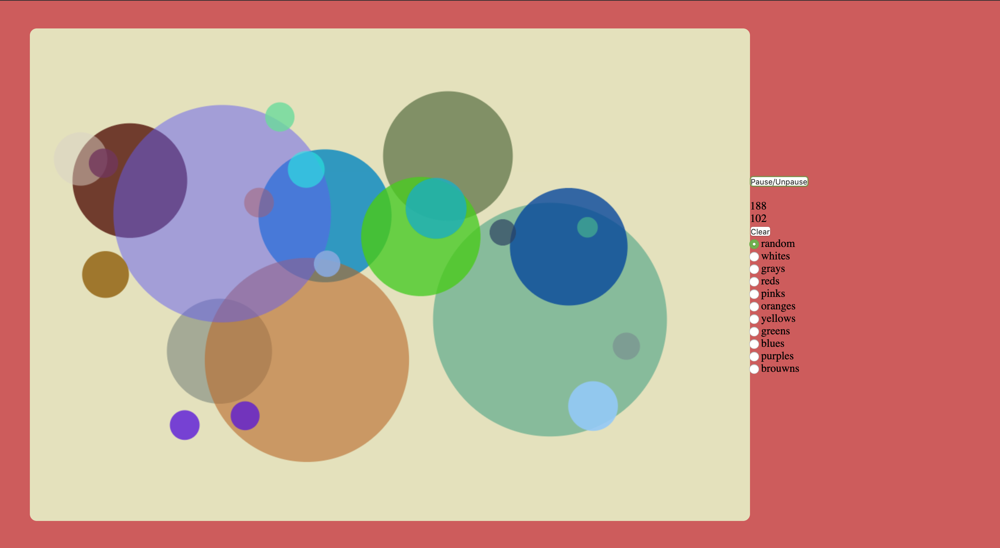

# Orbs

**Beginnings of a calming physics simulator/game - built before web development curriculum**  

* Click and hold down on the canvas to create an orb of varying size.
* Let go and watch it bounce, up to 25 can be on the canvas at a time.
* Orbs stuck the the side walls of the canvas will float around the screen.
* Choose different types of colors.

### Technologies
* vanilla Javascript
* JS canvas

### TODO
* refactor code to be OO (e.g. orbs can be instances of the class Circle)
* styling to be more visually appealing
* add a naming feature and give 'personalities' to each orb
* add more dynamic bouncing for different types of orbs
